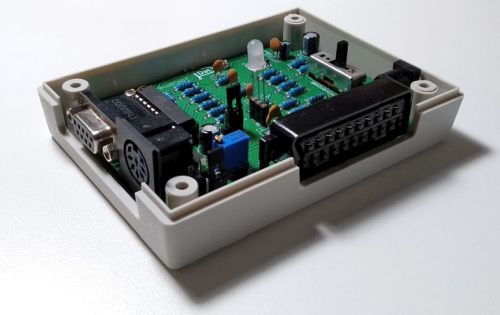
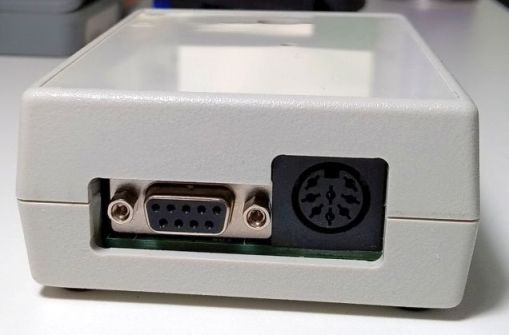
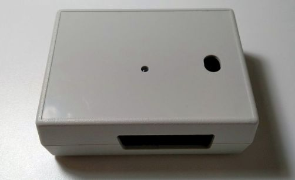
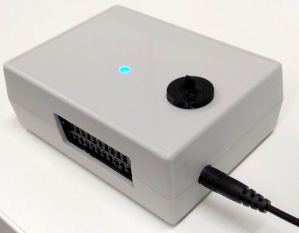

<h2>C128toSCART_THT</h2>

This is a project to connect a&nbsp;Commodore C128 8-bit computer to a display with a SCART input device.

Here, you can find some documents to build the video adapter PCB which I developed.

Get the information, build your PCB and have some 8-bit fun.

I started this project because I wanted to use my old Commodore 128DCR with a modern display.

I only had&nbsp;a 30-year-old SCART-cable that combines the 9 pin D-SUB RGBI connector and the 8 pin DIN connector for audio and video output.

I reverse engineered the old cable and got into this content. The Commodore 128DCR has 2 separate video chips.

The VIC-chip that provides the 40 column video mode in a composite and s-video signal and the VDC-chip that provides the 80 column video mode in a 5V TTL level RGBI signal.&nbsp;

It is possible to use the C128 with 2 displays. One display that supports RGBI for the 80 column mode and another display that supports composite or s-video for the 40 column mode.

I wanted just one display that supports both and that was the reason why I used&nbsp;the SCART interface.

The SCART standard provides RGB, composite, s-video and component (Y Pb&nbsp;Pr). It is possible to use only one display and to switch between the two column modes.

I researched and created a PCB that converts the digital 5V TTL 4 bit RGBI signal into a analog RGB signal. For that I used a EEPLD (electrical erasable&nbsp;&nbsp;programmable logic device) that converts the 4 bit RGBI color code into a 6 bit RGB color code. A resistor network adapts the TTL level to the analog RGB voltage level.

This all happens between the 9 pin D-SUB connector and the manual switch.

The composite or s-video signal goes from the C128 DIN connector straight through the switch.

The SWITCH is just for switching the right signals to the right pins of the SCART connector to run the display device.

In the following directories you will find the necessary files for the PCB, the soldering, the part list, the housing and the switch-extension.

## Contact
For any questions (technical or experience) or puchase a CNC milled housing, please use the issue tracking system of github.

<strong>Mail to: kernelpanic_74[at]yahoo.de</strong>

Now some pictures of the project.&nbsp;Enjoy!

This is the open housing with the soldered PCB mounted in

The closed housing with the connections sockets to the C128 (D-SUB for RGBI &amp; DIN for the A/V Plug)

The view from above - the hole for the 3mm DUO-LED and the long hole for the switch-extension. 
It is also possible to toggle the switch with a pencil or something else ;)

The 3D printed switch-extension is plugged in. 
Device switched in 80 column mode (the blue LED indicates that) powered from a 5V USB-Charger with a barrel plug. 
It is possible to use the RGBI/CGA output of an&nbsp;old PC with a CGA graphic card to&nbsp; use a SCART display device.&nbsp;

